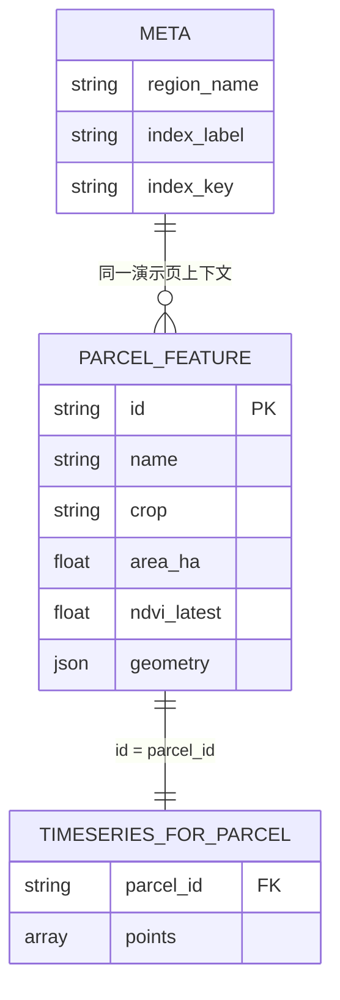

# 农业遥感演示页 · 数据结构约定

本文档根据**监测地块表格**、**NDVI 时序曲线**等界面与当前模拟 JSON，约定**演示/联调阶段**的数据形状，便于前后端对齐；**正式环境**可拆分为多个 REST 资源，见 §7；**是否落多表、如何演进**见 §9。

关联需求：[REQUIREMENTS.md](./REQUIREMENTS.md)、前端地图见 [TITILER_FRONTEND.md](./TITILER_FRONTEND.md)。

---

## 0. 有几块数据、之间什么关系？

演示数据**不是多张数据库表**，而是**一次返回的一包 JSON** 里，固定 **3 个顶层键**；若按「逻辑块」理解，可以记成 **3 类、2 层关联**：

| # | 逻辑名称 | 在 JSON 里的位置 | 个数（相对整包） | 和其它的关系 |
|---|----------|------------------|------------------|--------------|
| **①** | **页面元数据** | `meta` | **始终 1 个对象** | 描述本页：区域名、当前指数名等；**不**直接挂地块 |
| **②** | **地块列表 + 地图几何** | `parcels` → `features[]` | **N 个** `Feature`（演示里 N=4） | 每个要素有 **`properties.id`**（如 `p1`），是关联键 |
| **③** | **时序曲线数据** | `timeseries` | **N 个键**（与地块 id 一一对应），每个键下 **M 个点** | **键名 === ② 里的 `properties.id`**；一点一行 `{ date, ndvi, quality }` |

**关系一句话**：`meta` 管「这一屏在讲哪个区、哪种指数」；`parcels.features` 里 **一行/一块地** 用 **`id`** 去 `timeseries` 里找 **同名 key**，得到这条地的折线点列。

**数量核对（演示数据）**：

- 顶层：**3** 块（`meta`、`parcels`、`timeseries`）。
- 地块：**4** 个 `Feature` ⇒ `timeseries` 里应有 **4** 个 key（`p1`…`p4`），缺 key 或多余 key 都应在联调时视为数据不一致。

### 0.1 关系示意图

```text
                    ┌──────────────────┐
                    │  meta（1 份）     │  region_name, index_label …
                    └────────┬─────────┘
                             │ 同一上下文
                             ▼
┌────────────────────────────────────────────────────────────┐
│  parcels.features[]（N 个地块要素）                          │
│  ┌─────────────┐  ┌─────────────┐       ┌─────────────┐   │
│ │ id=p1 name=…│  │ id=p2 …     │  …    │ id=p4 …     │   │
│ │ geometry    │  │ geometry    │       │ geometry    │   │
│ └──────┬──────┘  └──────┬──────┘       └──────┬──────┘   │
└────────┼────────────────┼─────────────────────┼───────────┘
         │                │                     │
         │  1 : 1         │                     │   （id 与 timeseries 的 key 同名）
         ▼                ▼                     ▼
┌────────────────────────────────────────────────────────────┐
│  timeseries（对象：键 = 地块 id）                            │
│  "p1" → [ {date, ndvi, quality}, … ]   （M 个点）          │
│  "p2" → [ … ]                                              │
│  …                                                         │
└────────────────────────────────────────────────────────────┘
```

### 0.2 ER 风格（便于和「表」类比）

若习惯用「实体—关系」想问题，可对应为下面 **3 个实体**（仍落在同一 JSON 里）：



说明：`TIMESERIES_FOR_PARCEL` 在 JSON 里并不是独立数组，而是 **`timeseries` 对象的一个键值对**；上图只为表达 **1 个地块 ↔ 1 组时序**。

---

## 1. 与界面的对应关系

| 界面区域 | 数据来源 | 说明 |
|----------|----------|------|
| 标题区「沈阳市（演示区）」 | `meta.region_name` | 区域/项目展示名 |
| 「指数 NDVI」 | `meta.index_label` + `meta.index_key` | 列表列头、曲线 Y 轴语义 |
| 监测地块表（地块 / 作物 / 面积 / NDVI） | `parcels.features[].properties` | 一行一个 `Feature`；选中行驱动下方曲线 |
| 地图多边形 | `parcels.features[].geometry` | `Polygon`，与列表同一 `id` |
| NDVI 色标小标签 | `properties.ndvi_latest` + 前端分级规则 | 见 §5 |
| 时序曲线标题「苏家屯示范田 A · NDVI 时序」 | `properties.name` + `meta.index_label` | 选中 `feature` 后展示 |
| 折线点（日期 + 数值） | `timeseries[parcel_id]` | `parcel_id` 与 `properties.id` 一致 |
| 「高程/底图 XYZ」开关 | **可选** `meta.map_options` | 演示期可由前端写死；若后端统一下发见 §3.3 |

---

## 2. 顶层结构（聚合 JSON，便于 Mock）

演示接口可一次返回整包 JSON，减少首屏请求次数：

```json
{
  "meta": { },
  "parcels": { "type": "FeatureCollection", "features": [ ] },
  "timeseries": { }
}
```

字段名建议统一 **`snake_case`**（下例与常见 REST/OpenAPI 一致）；若前端已用 `camelCase`，可在 BFF 做映射。

---

## 3. `meta`（页面级元数据）

| 字段 | 类型 | 必填 | 说明 |
|------|------|------|------|
| `region_name` | `string` | 是 | 区域展示名，如「沈阳市（演示区）」 |
| `index_label` | `string` | 是 | 指数人类可读名，如「NDVI」 |
| `index_key` | `string` | 建议 | 机器可读键，如 `ndvi`；扩展 EVI 时与 `timeseries` 内数值字段一致 |
| `demo` | `boolean` | 否 | 是否为演示数据，默认 `true` 时可显示「演示」角标 |
| `updated_at` | `string` (ISO8601) | 否 | 整包或指数产品批次更新时间 |

### 3.1 `index_key` 与时序字段的对应

- 当 `index_key === "ndvi"` 时，时序点中使用字段名 **`ndvi`**（与现有截图一致）。
- 扩展其他指数时，推荐使用通用字段 **`value`** + **`index_key`**，或约定 `evi`、`ndwi` 等并列字段（二选一在项目组内统一即可）。


## 4. `parcels`（GeoJSON FeatureCollection）

符合 [RFC 7946](https://datatracker.ietf.org/doc/html/rfc7946) 的 **`FeatureCollection`**。

### 4.1 每个 `Feature` 的 `geometry`

| 约束 | 说明 |
|------|------|
| `type` | 暂为 `Polygon`（二期可支持 `MultiPolygon`） |
| `coordinates` | 环为 `[lon, lat]`，**WGS84**（等价 EPSG:4326） |
| 闭合 | 外环首尾坐标相同 |

### 4.2 `properties`（与表格列对齐）

| 字段 | 类型 | 必填 | 说明 |
|------|------|------|------|
| `id` | `string` | 是 | 地块唯一标识，与 `timeseries` 的键一致，如 `p1` |
| `name` | `string` | 是 | 列表「地块」列，如「苏家屯示范田 A」 |
| `crop` | `string` | 否 | 作物类型，如「玉米」 |
| `area_ha` | `number` | 是 | 面积（公顷），≥ 0 |
| `ndvi_latest` | `number` \| `null` | 是 | 当前展示时相的指数值；无数据时为 `null` |

**命名说明**：`ndvi_latest` 在仅支持 NDVI 的演示期最直观；若抽象为多指数，可改为 `index_latest` 或与 `meta.index_key` 组合（如动态键，文档需在 OpenAPI 中显式枚举）。

---

## 5. 列表 NDVI 色标（前端展示建议）

与截图中绿/橙边框一致，可用**固定阈值**（可配置化）：

| 条件（示例） | 语义 | UI 建议 |
|--------------|------|---------|
| `value >= 0.65` | 偏高/长势好 | 绿色描边 |
| `0.50 <= value < 0.65` | 中等 | 橙色描边 |
| `value < 0.50` | 偏低/关注 | 深橙或黄描边 |
| `null` 或缺失 | 无有效观测 | 灰色 + 文案「无数据」 |

具体阈值以产品为准，**不必写入本 JSON**，除非要做服务端与多端严格一致时再增加 `meta.ndvi_style_thresholds`。

---

## 6. `timeseries`（按地块 ID 索引）

### 6.1 形状

- 类型：对象（字典），**键** = `parcels.features[].properties.id`
- 值：有序数组，按 **`date` 升序** 排列（便于直接绑图表）

### 6.2 单个时序点（当前 NDVI 演示）

| 字段 | 类型 | 必填 | 说明 |
|------|------|------|------|
| `date` | `string` | 是 | 建议 `YYYY-MM-DD`；或 ISO 日期时间，前后端统一即可 |
| `ndvi` | `number` \| `null` | 是 | 该日（或合成窗代表日）的指数；无效像元可为 `null` |
| `quality` | `string` | 建议 | 质量或场景标记，见 §6.3 |

### 6.3 `quality` 建议枚举（可扩展）

| 取值 | 含义（示例） |
|------|----------------|
| `ok` | 可正常使用 |
| `cloudy` | 云量高，数值可信度低 |
| `drought` | 干旱/墒情相关标记（演示） |
| `missing` | 无有效合成产品 |

OpenAPI 中可用 `enum` 约束；新增取值需兼容旧前端（默认当普通标签展示）。

### 6.4 图表交互

- **X 轴**：`date`
- **Y 轴**：`ndvi`（或 `value`），范围通常 `0~1`（按产品定义可为 `-1~1`）
- **质量标记**：可用不同点形状、tooltip 文案展示 `quality`，与需求「云量高时有说明」一致

---

## 7. 与正式接口的映射（后续实现）

演示用**单接口**聚合；落地时可拆为：

| 建议接口 | 资源 |
|----------|------|
| `GET /api/v1/agri/dashboard` 或 `.../demo-bundle` | 返回本文档整包结构（仅演示/开发） |
| `GET /api/v1/agri/parcels` | 返回 `FeatureCollection`（可加分页、组织过滤） |
| `GET /api/v1/agri/parcels/{id}/timeseries` | 查询参数：`index`、`from`、`to`，返回点列 |

权限、组织隔离见 [REQUIREMENTS.md](./REQUIREMENTS.md) §3.1。

---

## 8. 校验要点（后端/契约）

- `parcels.features` 中 **`properties.id` 唯一**。
- `timeseries` 的每个键均应在 `parcels` 中存在对应 `id`（演示可放宽，正式建议校验）。
- `ndvi`、`ndvi_latest` 建议在业务上限制在 **`[-1, 1]`** 或 **`[0, 1]`**（与产品一致后写死）。
- GeoJSON 多边形自相交、面积过小等可在二期加 GIS 校验。

---

## 9. 可维护性与库表演进（聚合 JSON vs 多表）

当前演示结构**适合 Mock 与首屏聚合**，但若直接当作**唯一持久化形态**，后期会遇到：数据重复、权限难绑、时序爆炸、指数扩展困难。下面从**维护成本**说明是否、何时拆成多表（或等价的多资源）。

### 9.1 当前结构的主要维护风险

| 风险 | 说明 |
|------|------|
| **冗余与一致性** | `ndvi_latest` 与 `timeseries` 最后一个点可推导；两处存易**不一致**（补数、回算、不同产品批次）。 |
| **对象型 `timeseries`** | 键为业务 id，对 DB 不自然；**无法按日期范围索引**、难做「全区域某日统计」类分析。 |
| **`meta` 与地块混在一起** | 区域名、指数若写死在包里，多区域、多项目、多组织时**无法复用同一套地块**。 |
| **权限与审计** | 真实系统需 `org_id`、`created_by`、可见范围；聚合 JSON 若不断塞字段，**契约膨胀**且难缓存。 |
| **栅格与统计分离** | COG/瓦片 URL、观测元数据（传感器、云量）通常**独立生命周期**；和「地块均值时序」绑在一包 JSON 里会难版本化。 |

结论：**演示 JSON 可保留为「只读聚合视图」**；**权威数据建议落库为多表（或多集合）关系模型**。

### 9.2 建议的「逻辑表」拆分（与演示字段的映射）

不必一上来建满表，可按阶段加；以下为**推荐边界**，便于后期维护：

| 逻辑表 / 实体 | 职责 | 与演示 JSON 的对应 |
|---------------|------|---------------------|
| **organization**（组织） | 租户、订阅 | 演示可缺省；正式必填，所有业务表带 `org_id`。 |
| **region** 或 **project**（区域/项目） | 「沈阳市（演示区）」一类**稳定配置** | 对应 `meta.region_name` 的**规范化**；地块挂 `region_id` 或 `project_id`。 |
| **parcel**（地块） | 边界、名称、作物、面积、所属组织 | `parcels.features` 拆行；几何用 **PostGIS `geometry(Polygon,4326)`**，属性列存 `name`、`crop`、`area_ha`（面积可**计算存储**或仅存人工修正）。 |
| **index_definition**（指数定义） | `ndvi` / `evi` 的代码、展示名、合法范围 | 对应 `meta.index_key`、`index_label`；避免魔法字符串散落。 |
| **parcel_index_timeseries**（时序事实表，**窄表**） | 一行 = 某地块 × 某指数 × 某日（或观测窗）× 值 + 质量 | 替代 `timeseries[p1]` 数组；列如 `parcel_id, index_key, obs_date, value, quality, product_id?`。 |
| **parcel_index_latest**（可选**物化**） | 当前屏展示的「最新值」 | 对应 `ndvi_latest`；建议由**任务或触发器**从时序或产品表更新，**禁止**与明细长期手写双写。 |
| **raster_product**（可选） | COG 路径、观测日、瓦片 URL、TiTiler 参数 | 与列表里的 latest、地图图层同源；地块均值可由**离线统计**写入 `parcel_index_timeseries`。 |

**关系小结**：

- `org` 1 — N `parcel`  
- `region/project` 1 — N `parcel`（按产品选）  
- `parcel` 1 — N `parcel_index_timeseries`（按 `index_key` + `obs_date` 唯一约束）  
- `index_definition` 1 — N `parcel_index_timeseries`（FK 或枚举约束）  

### 9.3 为什么时序用「窄表」而不是 JSON 大对象

- **查询**：`WHERE parcel_id = ? AND obs_date BETWEEN ? AND ?` 走索引；对象里嵌数组难以部分加载。  
- **写入**：新增一期产品 = **插入多行**（每地块一行或每像元统计一行），无需反序列化整包 JSON。  
- **扩展**：多指数 = 多 `index_key` 或关联 `index_definition_id`，不必改顶层 JSON 形状。  

### 9.4 推荐演进路径（不必一步到位）

| 阶段 | 持久化 / API | 说明 |
|------|----------------|------|
| **P0 演示** | 静态 JSON 或单表 `demo_bundle` | 快；无事务要求。 |
| **P1 MVP** | `parcel` + `parcel_index_timeseries` + 最小 `org` | 列表、曲线、权限可绑 `org_id`。 |
| **P2** | 增加 `raster_product`、`latest` 物化、**区域/项目**表 | 与 TiTiler、对象存储对齐；去冗余 latest。 |
| **P3** | 分析/报表只读库、分区表（按日期） | 时序量大时按 `obs_date` 分区。 |

### 9.5 API 与存储不必同形

- **库内**：多表、第三范式为主，关键冗余仅 **物化视图 / latest 表**。  
- **对外**：仍可提供 **`GET .../dashboard-bundle`**，由服务层 **JOIN/组装** 成当前演示 JSON，供前端省请求；**写操作**不要直接 PATCH 整包。  

这样既保留演示/首屏体验，又避免「整包 JSON 即数据库」的长期技术债。

### 9.6 可选：示意 DDL 片段（PostGIS，仅作讨论稿）

```sql
-- 示意：正式环境请按迁移工具与命名规范调整
CREATE TABLE parcel (
  id          uuid PRIMARY KEY,
  org_id      uuid NOT NULL REFERENCES organization(id),
  region_id   uuid REFERENCES region(id),
  name        text NOT NULL,
  crop        text,
  geom        geometry(Polygon, 4326) NOT NULL,
  area_ha     numeric(12,4),  -- 可由 ST_Area 计算更新
  created_at  timestamptz DEFAULT now()
);

CREATE TABLE parcel_index_timeseries (
  parcel_id   uuid NOT NULL REFERENCES parcel(id),
  index_key   text NOT NULL REFERENCES index_definition(key),
  obs_date    date NOT NULL,
  value       double precision,
  quality     text,
  product_id  uuid REFERENCES raster_product(id),
  PRIMARY KEY (parcel_id, index_key, obs_date)
);
```

（`index_definition`、`raster_product`、`organization`、`region` 略。）

---

## 10. 完整示例（与当前模拟数据等价）

以下为 **`snake_case`** 版本，与正文字段一致；可直接作为 Mock 文件或单测固件。

```json
{
  "meta": {
    "region_name": "沈阳市（演示区）",
    "index_label": "NDVI",
    "index_key": "ndvi",
    "demo": true
  },
  "parcels": {
    "type": "FeatureCollection",
    "features": [
      {
        "type": "Feature",
        "properties": {
          "id": "p1",
          "name": "苏家屯示范田 A",
          "crop": "玉米",
          "area_ha": 18.6,
          "ndvi_latest": 0.72
        },
        "geometry": {
          "type": "Polygon",
          "coordinates": [
            [
              [123.35, 41.62],
              [123.38, 41.62],
              [123.38, 41.65],
              [123.35, 41.65],
              [123.35, 41.62]
            ]
          ]
        }
      }
    ]
  },
  "timeseries": {
    "p1": [
      { "date": "2025-05-01", "ndvi": 0.28, "quality": "ok" },
      { "date": "2025-07-15", "ndvi": 0.72, "quality": "ok" }
    ]
  }
}
```

（其余 `p2`–`p4` 与贵方 JSON 相同，实现时补全即可。）

---

## 11. 关联文档

- [REQUIREMENTS.md](./REQUIREMENTS.md)
- [DEV_PLAN.md](./DEV_PLAN.md)
- [TITILER_FRONTEND.md](./TITILER_FRONTEND.md)
