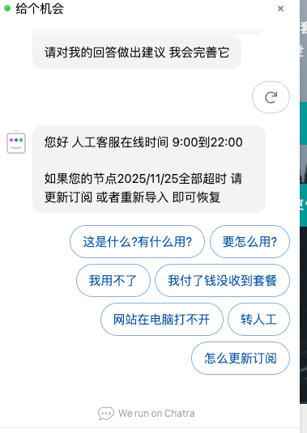

# AI 问答：开发计划（后端 + 联调前置）

本文档在 [REQUIREMENTS.md](./REQUIREMENTS.md) 基础上，给出 **服务端（本仓库 `server_python`）** 的分阶段实现计划：**LangGraph 编排**、**DeepSeek（OpenAI 兼容 API）**、**知识库检索（可与页面快捷问题联动）**，以及供 **前端首页聊天窗口** 调用的 HTTP 接口约定。  
前端 UI（React + antd + Tailwind、浮标与面板）按需求文档在 **Web 工程** 中实现；本计划侧重 **编排层、API 与数据流**。

---

## 0. 界面参考（需求对齐）

以下为产品侧提供的 **聊天浮窗 / 面板** 参考效果（客服类 Widget：顶栏、消息区、**快捷问题 pill**、底栏输入等），实现时以 [REQUIREMENTS.md](./REQUIREMENTS.md) §4 为准，视觉可对齐参考图。



**与后端相关的交互要点**：

| 参考图要素 | 后端/契约侧建议 |
|------------|-----------------|
| 快捷问题 chip（如「这是什么？有什么用？」） | 点击后等价于发送一条 **user 消息**；可选携带 **`quick_question_id`**，便于 **知识库加权检索**（见 §3.3）。 |
| 用户自定义输入 | 标准 `messages[]` 多轮。 |
| 「转人工」类按钮 | LangGraph 中可走 **独立节点**（返回固定话术 / 工单占位 / 外链），与纯模型回复区分。 |
| 助手回复气泡 | 对应接口返回的 `assistant` 文本；可附 `sources` 做「参考知识库片段」提示。 |

---

## 1. 安全与配置（必读）

| 项 | 说明 |
|----|------|
| **密钥** | `OPENAI_API_KEY` **仅配置在服务端**环境变量或密钥管理系统，**禁止**写入仓库、禁止下发给浏览器。 |
| **Base URL** | DeepSeek OpenAI 兼容入口：`https://api.deepseek.com`（与官方文档一致时可调整）。 |
| **模型名** | 对话常用：`deepseek-chat`；若需推理链可评估 `deepseek-reasoner`（以官方为准）。 |
| **密钥泄露** | 若密钥曾在聊天、截图或提交记录中出现，视为已泄露，应 **在控制台轮换/作废** 后换新 Key。 |

环境变量建议（名称可与现有 OpenAI SDK / LangChain 习惯对齐）：

| 变量 | 示例 | 说明 |
|------|------|------|
| `OPENAI_API_KEY` | （空，本地填 `.env`） | DeepSeek API Key |
| `OPENAI_API_BASE` | `https://api.deepseek.com` | 兼容客户端的 `base_url` |
| `AI_CHAT_MODEL` | `deepseek-chat` | 默认对话模型 |

本地复制项目根目录 `.env.example` 为 `.env` 后填写；**不要**把真实 Key 提交到 Git。

---

## 2. 目标架构：LangGraph + 知识库 + DeepSeek

采用 **[LangGraph](https://langchain-ai.github.io/langgraph/)** 将「检索 → 决策 → 调模型 → 后处理」显式编排，便于后续加 **条件分支**（如转人工、敏感词、工具调用），而不是在单一路由函数里堆 if-else。

```text
[浏览器 聊天窗口]
        │  POST /api/v1/ai/chat
        │  body: messages[], 可选 conversation_id, 可选 quick_question_id
        ▼
[FastAPI 路由]
        │  鉴权 / 限流（可选）
        │  构建 LangGraph State（messages、retrieved_chunks、route 等）
        ▼
[LangGraph StateGraph]
        │
        ├─► node: load_quick_question_hint（若带 quick_question_id，注入检索关键词/锚点）
        ├─► node: retrieve_kb（BM25/向量，Top-K 片段写入 state）
        ├─► node: route_intent（可选：是否「转人工」、是否拒答）
        ├─► node: llm_generate（Chat Completions，OpenAI 兼容客户端 → DeepSeek）
        └─► node: format_response（sources、免责声明片段）
        ▼
[HTTP JSON] message + sources（+ 可选 graph_debug 仅开发环境）
```

**与「仅直连 OpenAI SDK」对比**：MVP 可先用 **单节点图**（仅 `llm_generate`）跑通，再 **增量加入** `retrieve_kb` 与 `route_intent`，无需推翻接口形态。

**依赖建议**（实现阶段锁定版本）：

- `langgraph`
- `langchain-openai`（或 `langchain` + 自定义 `ChatOpenAI(base_url=..., api_key=...)` 指向 DeepSeek）
- 知识库 MVP：`rank-bm25` 或自研关键词评分（见 §5）

---

## 3. 知识库与「页面问题」联动

### 3.1 语料范围（首期）

- 目录：`docs/ai问答需求/**/*.md`（含 `REQUIREMENTS.md`、后续 **FAQ.md、产品说明.md** 等）。
- 启动时 **切块**（按 `##` / `---`），附 `source_path`、`heading` 元数据。

### 3.2 检索逻辑

- MVP：**BM25 / 关键词**，返回 Top-K（3～5）片段写入 Graph state。
- 用户 **最后一轮 user 内容** 作为检索 query；得分低于阈值则 **不注入** 伪事实，仅通用 system 提示。

### 3.3 快捷问题（答案参考页面问题）

目标：**快捷 chip 上的文案** 不仅是一条普通 user 消息，还可 **锚定知识库检索**，提高命中率（对齐参考图中的蓝色 pill）。

建议在 `docs/ai问答需求/` 增加 **`quick_questions.yaml`**（或 `.json`），由服务端加载，例如：

```yaml
# 示例结构（实现时以代码为准）
items:
  - id: what_is_it
    label: "这是什么?有什么用?"
    # 用于检索扩展：与同义问法、关键词、可关联的 md 锚点
    retrieval_query: "产品是什么 功能 用途 介绍"
    # 可选：优先匹配的源文件 glob 或段落标题
    prefer_sources:
      - "FAQ.md#intro"
  - id: transfer_human
    label: "转人工"
    graph_route: human_handoff   # LangGraph 边条件，不走纯 LLM 闲聊
```

**接口约定**（与 §6 一致）：

- 前端点击 chip：**推荐**发送  
  `messages` 末尾追加 `{ "role": "user", "content": "<label 原文>" }`，并同时传 **`quick_question_id: "what_is_it"`**。  
- 服务端：在 `retrieve_kb` 节点将 `retrieval_query` 与用户原文 **合并或加权**，再 BM25；`transfer_human` 则 **短路** 到固定回复节点。

> 产品可后期改为快捷问题 **后端下发**（`GET /api/v1/ai/quick-questions`），与 REQUIREMENTS **T5** 一致；MVP 可用静态 YAML + 前端写死 id 对齐。

---

## 4. LangGraph 状态与节点（设计草案）

### 4.1 State（示例字段）

| 字段 | 说明 |
|------|------|
| `messages` | Chat 消息列表（与 OpenAI 格式一致） |
| `retrieved_chunks` | 检索到的 `{text, source_path, score}` |
| `quick_question_id` | 可选，来自请求体 |
| `route` | 如 `answer` / `human_handoff` / `refuse` |
| `assistant_content` | 最终助手文本 |
| `sources` | 返回前端的引用列表 |

### 4.2 节点职责（可迭代增加）

| 节点 | 职责 |
|------|------|
| `hydrate_quick_question` | 解析 `quick_question_id`，写入检索扩展 query / 路由标记 |
| `retrieve_kb` | 查知识库，更新 `retrieved_chunks` |
| `decide_route` | 规则 + 可选轻量分类：转人工、敏感拒答 |
| `call_llm` | 拼装 system（含知识库摘录 + 免责声明）+ `messages`，调用 DeepSeek |
| `human_handoff_reply` | 固定话术（如人工时段、工单链接），不调用 LLM 或可二次调用 |
| `build_response` | 组装 `sources`、截断过长引用 |

### 4.3 图边（示意）

- `START` → `hydrate_quick_question` → `retrieve_kb` → `decide_route`  
- `decide_route` →（`human_handoff`）→ `human_handoff_reply` → `build_response` → `END`  
- `decide_route` →（`answer`）→ `call_llm` → `build_response` → `END`

---

## 5. 里程碑划分（更新）

### M0：契约与配置（0.5–1 天）

- [ ] `core/config.py`：`OPENAI_API_KEY`、`OPENAI_API_BASE`、`AI_CHAT_MODEL`；无 Key 时接口 **503** 明确提示。
- [ ] `.env.example` 已含 AI 相关占位。
- [ ] OpenAPI：`POST /api/v1/ai/chat`（含可选 `quick_question_id`），见 §6。
- [ ] 引入 `langgraph` 等依赖并锁定版本。

### M1：LangGraph 最小闭环（1–2 天）

- [ ] 编译 **单节点或两节点** Graph：`call_llm`（+ 可选 `build_response`），先 **不接** 知识库，验证 DeepSeek 调用与错误映射。
- [ ] FastAPI 路由内 **`graph.invoke`** / `graph.ainvoke`，返回统一 JSON。
- [ ] 单元测试：Mock LLM client，测图与 HTTP 层。

### M2：知识库检索 + 快捷问题（1–2 天）

- [ ] 语料加载与切块（`docs/ai问答需求/**/*.md`）。
- [ ] `retrieve_kb` 节点 + BM25/关键词；阈值与 prompt 模板评审。
- [ ] `quick_questions.yaml` + `hydrate_quick_question` 节点。
- [ ] 响应字段 **`sources`** 稳定格式。

### M3：意图与转人工（0.5–1.5 天）

- [ ] `decide_route` + `human_handoff_reply`（对齐参考图「转人工」场景）。
- [ ] 登录 / 限流 / 429 友好文案（REQUIREMENTS T1、FRONTEND 错误约定）。

### M4：增强（排期）

- [ ] **SSE 流式**：LangGraph `stream` / 自定义 `astream_events` 对接 `text/event-stream`（T3）。
- [ ] 向量检索、多租户知识库、管理端上传。

### M5：前端（非本仓库）

- [ ] 浮标、面板、消息列表、**快捷问题 chip**、错误态；对接 OpenAPI 与 [FRONTEND.md](../FRONTEND.md)。

---

## 6. API 契约草案（与 OpenAPI 对齐后为准）

### `POST /api/v1/ai/chat`

**Request（JSON）**

```json
{
  "messages": [
    { "role": "user", "content": "这是什么？" }
  ],
  "conversation_id": "可选",
  "quick_question_id": "可选，与 quick_questions.yaml 中 id 对应，用于知识库检索加权或路由"
}
```

**Response 200（JSON）**

```json
{
  "message": {
    "role": "assistant",
    "content": "完整回复文本"
  },
  "sources": [
    { "title": "节选标题", "path": "docs/ai问答需求/FAQ.md" }
  ],
  "route": "可选：answer / human_handoff，供前端展示不同 UI"
}
```

**错误**：`503`（未配置 Key / 图执行失败）、`429`（限流）、`413`（过长）；`detail` 对齐 [FRONTEND.md](../FRONTEND.md) §5。

### `GET /api/v1/ai/quick-questions`（可选，T5）

返回 `{ "items": [{ "id", "label" }] }`，供前端渲染 chip；内容仍可由 YAML 驱动。

---

## 7. 知识库设计细节（M2 补充）

| 项 | MVP 建议 |
|----|-----------|
| 存储 | 内存索引 + 启动扫描 `docs/ai问答需求/` |
| 快捷问题 | `quick_questions.yaml` 与 chip 一一对应，检索 query 可人工编写以保证「页面问题 → 答案有依据」 |
| 无关问句 | 低分不注入；LLM system 中要求「不知则明说」 |

---

## 8. 与需求文档的映射

| REQUIREMENTS | 本计划 |
|--------------|--------|
| §4.1–4.2 浮标与面板 | 参考 §0 截图 + 前端实现 |
| §4.3 对话与 AI | LangGraph + DeepSeek；MVP 整段，SSE 在 M4 |
| §4.4 免责声明 | system 固定句 + 前端文案 |
| §6 T5 快捷问题配置 | YAML + 可选 `GET .../quick-questions` |

---

## 9. 下一步（执行顺序建议）

1. 产品确认：T1 登录、T3 流式排期、T5 快捷问题静态 vs 接口下发。  
2. 本仓库：M0 → M1（LangGraph + DeepSeek 最小图）。  
3. 补充语料与 **`quick_questions.yaml`**。  
4. M2 检索与快捷问题联动。  
5. M3 转人工节点与限流。  
6. 前端按 REQUIREMENTS + §0 参考图落地。

---

## 10. 文档索引

| 文档 | 用途 |
|------|------|
| [REQUIREMENTS.md](./REQUIREMENTS.md) | 产品范围与验收 |
| **DEV_PLAN.md**（本文） | LangGraph、知识库、快捷问题、API 草案 |
| [../FRONTEND.md](../FRONTEND.md) | 前后端通用约定 |
| [./assets/ui-reference-chat-widget.png](./assets/ui-reference-chat-widget.png) | 界面参考截图 |

---

*修订请更新版本说明，并与 OpenAPI / 前端仓库同步。*
